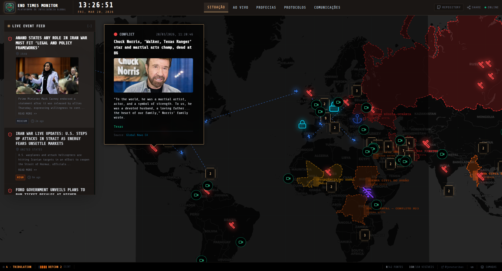

  
    

  # 🌍 End Times Monitor
  
  **A comprehensive global intelligence platform for monitoring eschatological events, conflicts, disasters, and prophetic developments in real-time.**
  
  <h3>
    <a href="https://endtimes.live">🔴 ACESSAR A PLATAFORMA AO VIVO: endtimes.live</a>
  </h3>

  

    <a href="#-visão-geral-overview">Visão Geral</a> •
    <a href="#-como-funciona-a-inteligência">Como Funciona</a> •
    <a href="#-fontes-de-dados-osint">Fontes de Dados</a> •
    <a href="#-arquitetura-e-ia">Arquitetura & IA</a> •
    <a href="#-como-contribuir">Contribuir</a>
  

---

## 📖 Visão Geral (Overview)

O **End Times Monitor** é uma plataforma avançada de *OSINT* (Inteligência de Fontes Abertas) e agregação de dados. Nossa missão é rastrear eventos globais relevantes para a profecia bíblica, conflitos geopolíticos, desastres naturais e pandemias, conectando o noticiário atual com o contexto das escrituras.

O sistema exibe o mundo como um radar militar: classificando, pontuando a gravidade e plotando tudo em um globo interativo.

**🌐 Explore o sistema ao vivo em [endtimes.live](https://endtimes.live)** e veja as zonas de conflito e eventos de ruptura acontecendo agora.

---

## ⚙️ Como Funciona a Inteligência?

O sistema opera 24/7 rastreando a internet através de "coletores" (collectors) construídos no nosso backend. 

1. **Agregação Contínua**: O backend varre periodicamente 9 fontes de dados diferentes, desde o Banco Mundial até canais do Telegram e Mercados de Previsão.
2. **Análise de Risco (Scoring)**: Todo evento recebe uma classificação de gravidade (Baixa, Média, Alta ou Crítica) baseada na letalidade e impacto global.
3. **Consolidação em Tempo Real**: Os resultados são plotados imediatamente no mapa interativo com ícones de radar militar. O mapa alerta o usuário visualmente para zonas de grande calor geopolítico ou ambiental.

---

## 📊 Fontes de Dados (OSINT)

Utilizamos as fontes de dados de maior autoridade e agilidade na internet:

* **GDACS / NASA EONET / USGS / FIRMS**: Monitoramento de terremotos, vulcões, anomalias térmicas e furacões.
* **ACLED / GDELT**: Bancos de dados de conflitos armados, protestos globais e extração de notícias de mais de 100 idiomas.
* **WHO (OMS)**: Emergências de saúde globais e registro de pandemias.
* **Polymarket**: Inteligência financeira baseada em mercados de previsão para prever escaladas geopolíticas (Ex: Probabilidade de invasões).
* **Telegram OSINT**: Rastreamento em tempo real de canais de guerra que publicam no minuto em que o evento acontece.

> 📚 *Quer saber como processamos isso? Leia o [Guia Completo de Fontes de Dados](docs/DATA_SOURCES_README.md).*

---

## 🤖 Arquitetura e IA (Google Gemini)

Muito mais do que um mapa, o End Times Monitor é equipado com um **Conselheiro Tático baseado em IA (Google Gemini)**. Ele atua como um analista de inteligência:
- Avalia os eventos que estão ocorrendo.
- Compreende efeitos em cascata (Ex: Um terremoto que pode gerar crise de abastecimento).
- Traça correlações proféticas.

**Stack Tecnológico:**
- **Frontend**: React 18, TypeScript, Tailwind CSS, Leaflet Maps.
- **Backend / Workers**: Node.js rodando em Docker (processos de 15 em 15 minutos).
- **Banco de Dados**: Supabase (PostgreSQL) com segurança rigorosa (*Row Level Security*).
- **Deploy**: Docker Compose em VPS com nginx/Traefik.

---

## 🤝 Como Contribuir

O repositório do **End Times Monitor** agora é focado em receber desenvolvedores, pesquisadores de OSINT, e estudantes de teologia que queiram melhorar a plataforma. Você pode ajudar adicionando novas fontes de inteligência, refinando as APIs ou melhorando o Frontend.

### Passos para desenvolvedores
Todos os guias técnicos, de configuração e de ambiente local foram movidos para a pasta `/docs/`. Se for a sua primeira vez, comece por aqui:

1. Leia o nosso **[Guia de Contribuição (CONTRIBUTING.md)](CONTRIBUTING.md)** para entender como enviar seu Pull Request (Envios diretos para a `main` estão bloqueados).
2. [Guia Rápido / Setup Local](docs/QUICK_START.md) — Para rodar o projeto na sua máquina.
3. [Plano de Arquitetura](docs/ARCHITECTURE_PLAN.md) — Compreenda o código fonte.
4. [Avisos Críticos de Servidor (VPS)](docs/VPS_MAINTENANCE.md) — Requisitos essenciais de deploy.

> **O End Times Monitor foi construído como um relógio global. 
> Nosso objetivo não é causar pânico, mas promover consciência situacional.**

---

  <b>🌍 "Quando o mundo muda, seja o primeiro a saber."</b> 
  Construído com ❤️ para a comunidade.  
  <a href="https://endtimes.live">Acessar EndTimes.live</a>

